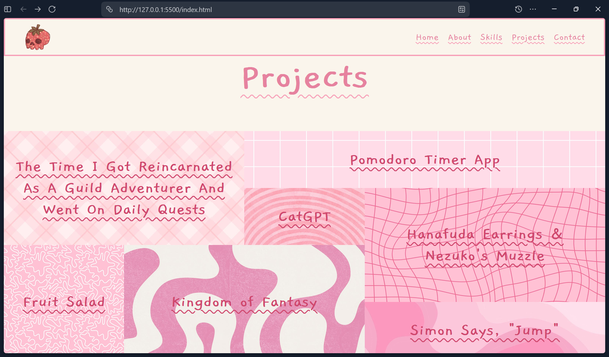

# Intro Of Me
my very own personal portfolio website. tried to include some cool features in this project!!

## Features
- single long page for portfolio
- pink themed to match my profile
- used the text decoration wavy property in css
- 2 opposite direction marquees which stop on hover (referenced a yt tutorial, credited below)
- very very cool (my fav) project grid with details on hover (referenced a yt tutorial for hover tooltip, credited below)

## Project Screenshot
> put my fav section "projects" screenshot

## What I Learnt
- finding a good code example from someone else
- changing other people's code so that it can be used in my project
- designing (because it does look cute doesn't it?)
- making an infinite marquee
- making a super cool hover tooltip in html/css/js

## How to Use Locally
- download the repo as zip / clone the repo locally
- run `index.html` in browser

OR 

- clone the repo locally
- use `live server` extension in vs code
- click `go live` after opening `index.html` file

## Credits
- made by me
- color theme from: [pinterest](https://in.pinterest.com/pin/5488830793149280/)
- a lot of pink theme backgrounds from: pinterest (forgot to save all of their links)
- profile pic from: pinterest
- background removing on profile pic: photoroom bg remover
- skills section icons from: [svg repo](https://www.svgrepo.com/)
- corner blur effect on skills section marquee from: [codepen link](https://codepen.io/ramzibach-the-styleful/pen/ZENExza)
- infinite scroll marquee from: [codepen](https://codepen.io/optimisticweb/pen/oNOBwBq)
- hover tooltip effect in projects section from: [codepen link](https://github.com/subinedge/link-hover-animation/tree/master)

> AI USAGE:
> (very very very less :D)
> - used to debug my marquee having uneven spacing between content, ai code didn't help, but it just worked somehow later on while i was trying to fix it (idk what exact combo of code fixed it or why??)
> i tried to reference and understand other people's code like an actual dev instead of asking ai (because vibe coding sucks)